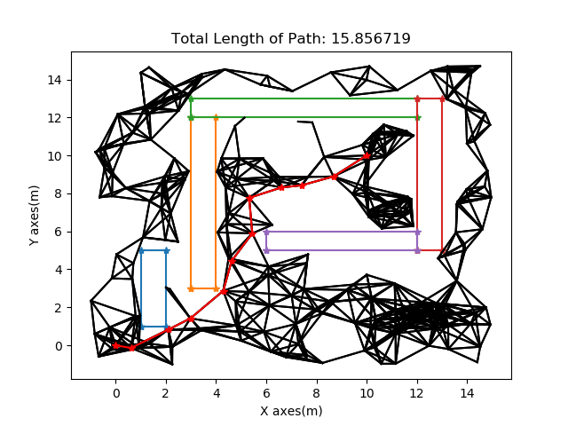

To install Matplotlib.cpp run the following lines

```
sudo apt-get install python-matplotlib python-numpy python3.8-dev 

cd <this_repo>/src
git clone https://github.com/lava/matplotlib-cpp
cd matplotlib-cpp
mkdir build
cd build
cmake .. && make -j4
```
If this runs without any errors that means matplotlibcpp is build. 
Now in this repository I've already placed matplotlibcpp.h in the ```src/```
Next run the following lines to make an executable file and run the programs


# Ques 1
Implementation of PRM Parameters can be changed by altering the declaration of PRM class.  To change the start and goal position modify : ```point goal, start;```, Search for this in the code.

```
cd <this_repo>/src
#to build the code
g++ Ques1.cpp -o Ques1 -std=c++11 -I/usr/include/python3.8 -lpython3.8
#To run PRM algorithm
./Ques1
```




# Ques 2
Implementation of PRM Parameters can be changed by altering the declaration of RRT class.  To change the start and goal position modify : ```point goal, start;```, Search for this in the code.

```
cd <this_repo>/src
#to build the code
g++ Ques2.cpp -o Ques2 -std=c++11 -I/usr/include/python3.8 -lpython3.8
#to run the RRT algorithm
./Ques2
```
